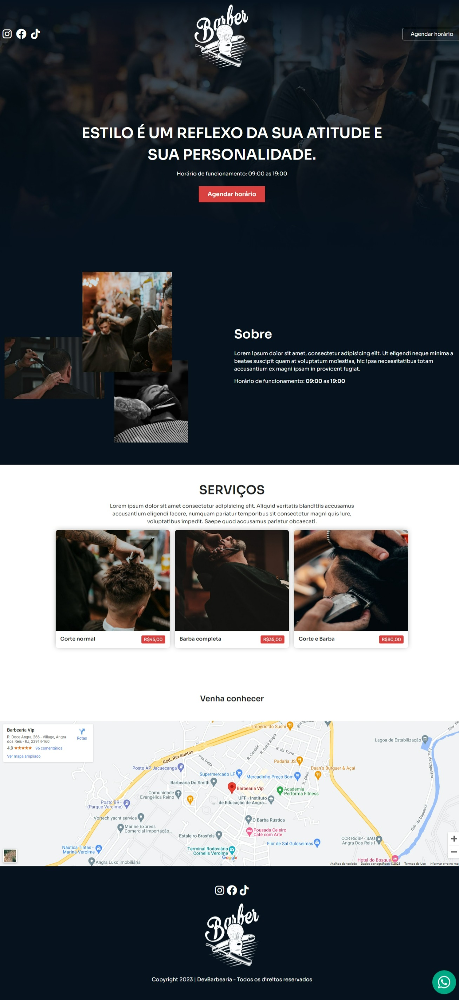
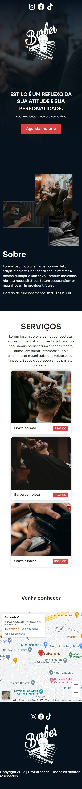

<h1 align="center" style="font-weight: bold;">DevBarbearia</h1>

<p align="center">
  <a href="#tech">Tecnologias</a> • 
  <a href="#about">Sobre</a> •
  <a href="#started">Começando</a> • 
  <a href="#colab">Colaboradores</a> •
  <a href="#contribute">Contribuir</a>
</p>

<p align="center">
    <b>Landing Page de uma Barbearia</b>
</p>

<h2 id="layout">🎨 Layout</h2>

<p align="center">
    <h3>Desktop</h3>
        
    <h3>Mobile</h3>
        
</p>

<h2 id="tech">💻 Tecnologias</h2>

- [HTML](https://devdocs.io/html) - Linguagem de marcação para estruturar a interface da aplicação.
- [CSS](https://devdocs.io/css) - Utilizado para estilizar a página, tornando-a atraente e responsiva.
- [SASS](https://sass-lang.com/) - Utilizado para adicionar novas funcionalidades no CSS, sem quebrar a compatibilidade, ou seja, no final o código é compilado, ou convertido para uma versão padrão.
- [AOS](https://michalsnik.github.io/aos/) - É uma biblioteca com muitas animações diferentes prontas para serem utilizadas.

<h2 id="about">Sobre</h2>

A landing page **DevBarbearia** é uma página estática desenvolvida para promover e destacar os serviços oferecidos por uma barbearia hipotética.

<h2 id="started">🚀 Começando</h2>

<h3>Clonando</h3>

Como clonar o projeto:

```bash
git clone https://github.com/vdonoladev/landingpage-barber
```

<h3>Iniciando</h3>

Você só precisa abrir o arquivo ```index.html``` e ser feliz.

<h2 id="colab">🤝 Colaboradores</h2>

Agradecimento especial a todas as pessoas que contribuíram para este projeto.

<table>
  <tr>
    <td align="center">
      <a href="#">
        <br>
        <sub>
          <b>Víctor Donola Ferreira</b>
        </sub>
      </a>
    </td>
  </tr>
</table>

<h2 id="contribute">📫 Contribuir</h2>

1. `git clone https://github.com/vdonoladev/landingpage-barber.git`
2. `git checkout -b feature/NAME-OF-FEATURE`
3. Siga os **Commit Patterns**
4. Abra um **Pull Request** explicando o problema resolvido ou o recurso feito, se houver, anexe a captura de tela das modificações visuais e aguarde a revisão!

<h3>Documentações que podem ajudar</h3>

- [📝 How to create a Pull Request](https://www.atlassian.com/br/git/tutorials/making-a-pull-request)

- [💾 Commit pattern](https://gist.github.com/joshbuchea/6f47e86d2510bce28f8e7f42ae84c716)

<h4>Créditos</h4>

A **aplicação** foi desenvolvida seguindo a série de vídeos do **Sujeito Programador**.

- [Aula 01](https://www.youtube.com/watch?v=Fzc_dnqD-V0)
- [Aula 02](https://www.youtube.com/watch?v=qeF7ZN5TegY)
- [YouTube](https://www.youtube.com/@Sujeitoprogramador)
